# Hướng dẫn sử dụng trang web Böss Group

- Trang web: **https://aluminumboss.com**
- Khu quản trị: **https://aluminumboss.com/Admin**

Khu quản trị viết bằng tiếng Anh. Tài liệu này giữ nguyên tên nút tiếng Anh (in đậm) để bạn dò
trên màn hình cho dễ. Mọi tên nút ở đây đã được đối chiếu với màn hình thật ngày 28/09/2026
(`tools/guide-check.js` kiểm lại khi cần). Ảnh chụp từ màn hình thật, **vòng cam** khoanh chỗ cần
bấm (`tools/guide-shots.js` chụp lại khi giao diện đổi).

---

## 1. Đăng nhập

Mở **https://aluminumboss.com/Admin**.

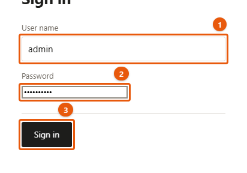
*Hình 1 — Trang đăng nhập. (1) tên, (2) mật khẩu, (3) bấm nút để vào.*

**Lần đầu tiên** dùng tên `admin`, mật khẩu `changeme`. Máy chủ sẽ bắt đổi mật khẩu ngay, trước
khi cho vào bất cứ màn hình nào:

1. **Current password**: gõ `changeme`
2. **New password** và **New password again**: mật khẩu mới, **ít nhất 10 ký tự**
3. Bấm **Change password**

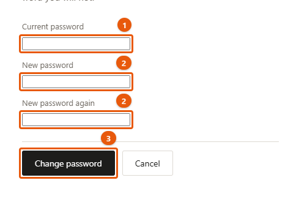
*Hình 2 — Trang đổi mật khẩu. (1) mật khẩu đang dùng, (2) mật khẩu mới gõ hai lần giống nhau, (3) bấm Change password.*

Ghi mật khẩu mới vào chỗ an toàn. Không có nút "quên mật khẩu" — quên thì phải nhờ người kỹ thuật
(mục 10). Việc đó mất khoảng một phút và **không mất lịch sử sửa**.

- **Đổi mật khẩu về sau:** bấm chữ **admin** ở góc trên bên phải.
- **Đăng xuất:** **Sign out**, cũng ở góc trên bên phải.

---

## 2. Khu quản trị có những gì

Vào `/Admin` là vào thẳng màn hình sửa trang. Thanh trên cùng có năm mục:

| Nút | Dùng để |
|---|---|
| **Edit pages** | Sửa chữ và ảnh ngay trên trang — dùng nhiều nhất |
| **Content** | Thêm, ẩn/hiện, đổi thứ tự, xoá các mục (bài tin, màu, dự án…) |
| **Pictures** | Kho ảnh: xem, tải lên, xoá |
| **Enquiries** | Đơn khách gửi qua form liên hệ |
| **History** | Các bản cũ — lấy lại khi lỡ tay |

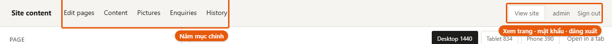
*Hình 3 — Thanh trên cùng: năm mục chính ở bên trái; bên phải là View site, tên admin (bấm để đổi mật khẩu) và Sign out.*

Góc phải: **View site** mở trang thật ở tab mới; **admin** để đổi mật khẩu; **Sign out**.

---

## 3. Sửa chữ trên một trang

Màn hình chia hai cột: **trái là các ô nhập, phải là trang web thật.**

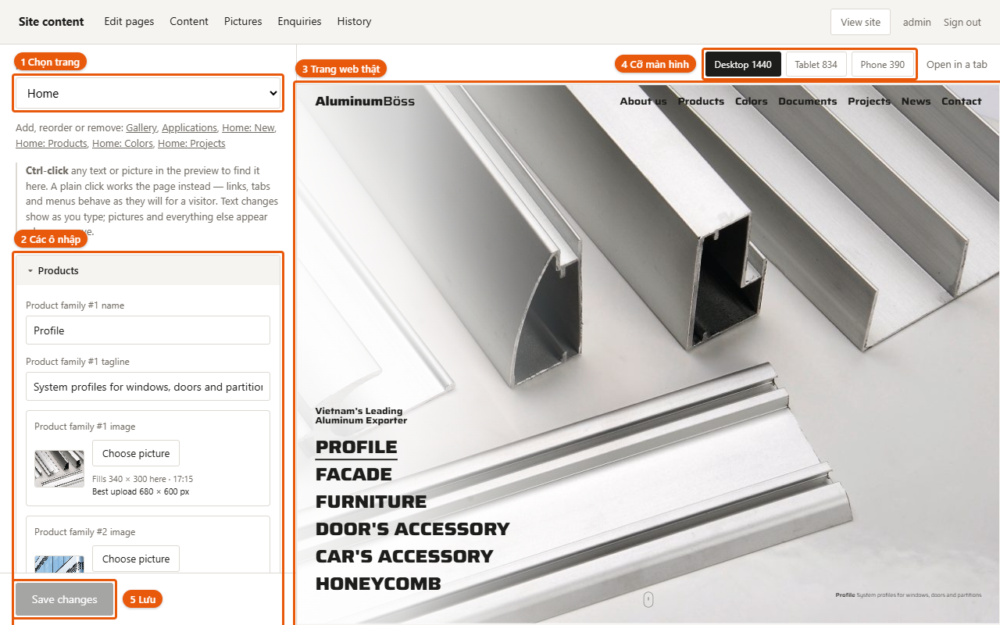
*Hình 4 — Màn hình Edit pages. (1) chọn trang cần sửa, (2) các ô nhập của trang đó, (3) trang web thật, (4) đổi cỡ khung xem, (5) nút lưu ở đáy cột trái.*

### Chọn trang cần sửa — ba cách

- Chọn ở ô **PAGE** trên cùng cột trái
- Bấm vào menu hoặc liên kết ngay trong khung bên phải — khung đi sang trang đó, cột trái đi theo
- Từ **Content**, bấm **Edit** ở dòng của mục cần sửa. Nhanh nhất khi cần sửa **một** bài tin, một
  màu, một dự án cụ thể.

### Chọn chữ cần sửa

> Giữ phím **Ctrl** rồi bấm vào chữ trong khung bên phải. (Máy Mac: giữ **Cmd**.)

Ô tương ứng ở cột trái sẽ sáng lên. **Bấm thường** (không giữ Ctrl) thì trang chạy như thật: bấm
menu là chuyển trang, bấm tab là đổi tab.

Mỗi ô có một dòng chữ nhỏ ở trên cho biết nó là gì, ví dụ *Article #1 summary* là phần tóm tắt
của bài đầu tiên.

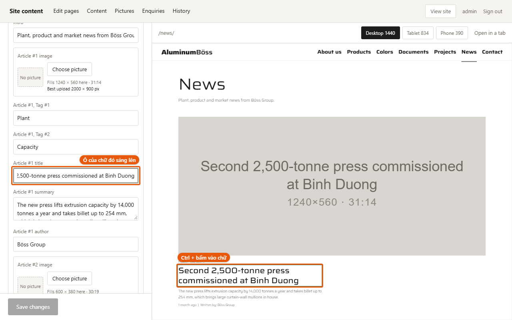
*Hình 5 — Giữ Ctrl và bấm vào tiêu đề bài tin trong khung bên phải: cột trái tự cuộn tới ô Article #1 title, ô đó sáng xanh và con trỏ nằm sẵn trong ô.*

### Lưu

1. Gõ vào ô — chữ trong khung bên phải đổi ngay khi gõ
2. Bấm **Save changes** ở đáy cột trái
3. Dòng nhỏ bên cạnh báo *1 change saved*. Khách vào trang là thấy luôn, không chờ gì cả.

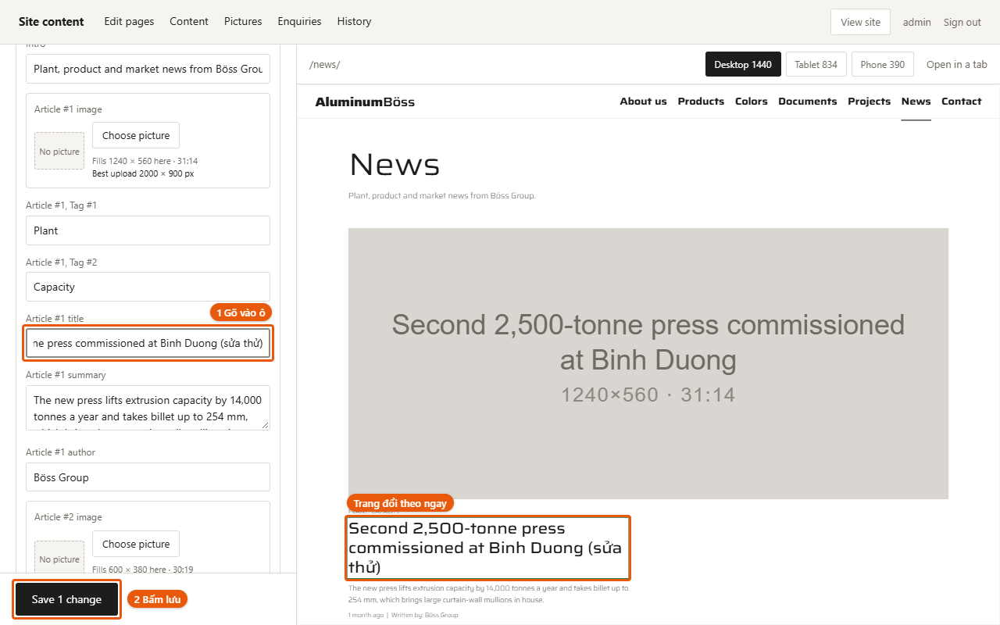
*Hình 6 — Gõ vào ô (1) thì chữ trên trang đổi theo ngay, nhưng chưa lưu. Nút ở đáy chuyển thành Save 1 change (2); bấm nó mới lưu thật.*

> **Chưa bấm Save changes thì chưa lưu gì.** Chuyển trang hoặc đóng tab khi đang sửa dở, máy sẽ
> hỏi lại.

### Xem trên điện thoại

Ba nút **Desktop 1440**, **Tablet 834**, **Phone 390** chỉ đổi cỡ khung xem. Nội dung chỉ có một
bản: sửa một lần là đúng cho mọi màn hình. **Open in a tab** mở trang đó trong tab riêng.

---

## 4. Đổi ảnh

Ô ảnh có nút **Choose picture**. Bấm vào mở kho ảnh:

- Bấm một ảnh có sẵn để chọn
- **Add a picture** để tải ảnh mới từ máy lên
- **No picture** để bỏ ảnh đi

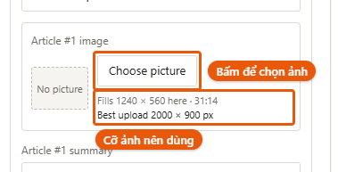
*Hình 7 — Một ô ảnh: ảnh đang dùng ở bên trái, nút Choose picture, và dòng cho biết cỡ ảnh nên tải lên.*

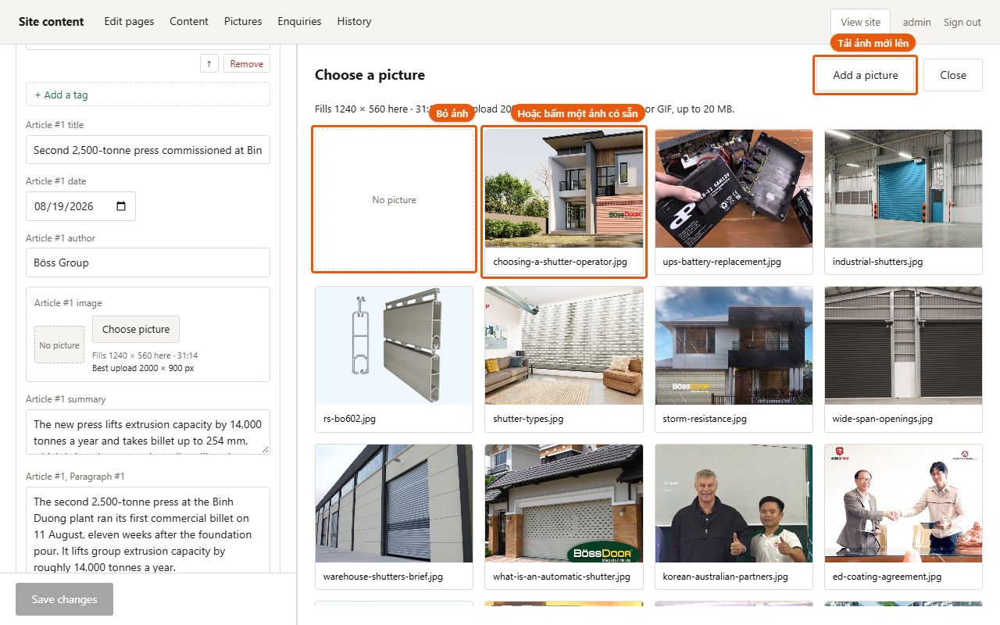
*Hình 8 — Kho ảnh mở ra bên phải. Bấm một ảnh có sẵn để chọn, No picture để bỏ ảnh, Add a picture để tải ảnh mới từ máy lên.*

Thay một ảnh đang có thì khung xem đổi ngay. Ô ảnh đang **trống** thì phải bấm **Save changes** mới
thấy ảnh hiện ra.

**Cỡ ảnh.** Dưới mỗi ô ảnh có dòng gợi ý, ví dụ *Best upload 680 × 600 px*. Máy chủ **không tự thu
nhỏ ảnh**, nên hãy giữ cạnh dài dưới **2000 px**. Ảnh chụp thẳng từ điện thoại (thường 4000 px,
vài MB) nên thu nhỏ trước khi tải lên, nếu không trang sẽ chậm với mọi người xem.

Nhận JPG, PNG, WebP, GIF, tối đa 20 MB.

**Xoá ảnh** ở màn hình **Pictures**: máy hỏi lại và cảnh báo trang nào còn dùng ảnh đó sẽ bị trống
chỗ. **Ảnh đã xoá không lấy lại được ở History.**

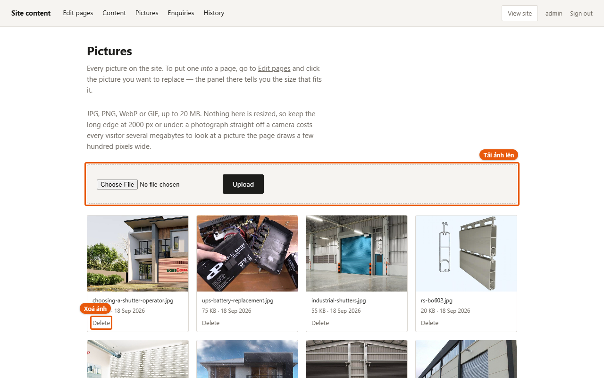
*Hình 9 — Màn hình Pictures: khung tải ảnh lên ở trên cùng, bên dưới là mọi ảnh trong kho, mỗi ảnh có nút Delete.*

---

## 5. Thêm, ẩn, đổi thứ tự, xoá — màn hình **Content**

**Content** liệt kê mọi loại nội dung kèm số lượng. Bấm vào một loại, mỗi dòng có:

| Nút | Làm gì |
|---|---|
| **Shown** / **Hidden** | Bấm để ẩn hoặc hiện. Mục ẩn vẫn còn, chỉ không hiện trên trang. |
| **↑** **↓** | Đổi thứ tự — thứ tự ở đây là thứ tự trên trang |
| **Edit** | Mở màn hình sửa, đúng trang của mục đó |
| **Delete** | Xoá. Máy hỏi lại: **Yes, delete it** hoặc **Keep it**, và cho biết có chỗ nào khác đang trỏ tới mục đó không |

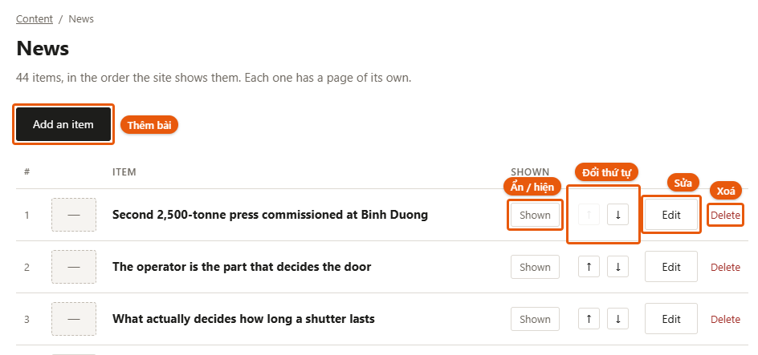
*Hình 10 — Màn hình Content → News. Add an item thêm bài; mỗi dòng có Shown (ẩn/hiện), ↑ ↓ (đổi thứ tự), Edit (sửa) và Delete (xoá).*

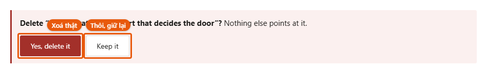
*Hình 11 — Bấm Delete thì máy hỏi lại trước khi xoá. Yes, delete it là xoá thật; Keep it là thôi.*

Nút **Add an item** ở đầu danh sách thêm một mục trống lên **dòng đầu tiên**.

> **Mục mới hiện ngay trên trang công khai, dù còn trống.** Thêm xong, bấm **Shown** ở dòng đó để
> thành **Hidden**, viết xong mới bấm lại cho hiện.

> **Lần lưu tên đầu tiên cũng đặt luôn địa chỉ.** Mục mới có một tên tạm như `new-3f9a2c`. Lần
> đầu bạn gõ tiêu đề và bấm Save, địa chỉ trang của nó thành tiêu đề ấy — **và sau đó không đổi
> nữa**, vì đổi là làm hỏng mọi đường dẫn người khác đã lưu. Gõ tiêu đề cho chuẩn ngay lần đầu.

**Một loại không thêm được:** **Export routes** — một tuyến cần hàng chục toạ độ trên bản đồ,
phải nhờ người kỹ thuật. Ẩn, đổi thứ tự, xoá và sửa chữ thì vẫn làm được. **Factories** thì thêm
được — xem ngay dưới đây.

**Bốn loại "Home:"** (Home: New, Home: Products, Home: Colors, Home: Projects) là **kệ trưng bày
trên trang chủ**, không phải nơi viết nội dung. Mỗi dòng có một ô chọn bài và nút **Set**: chọn bài
muốn trưng rồi bấm Set. Chữ và ảnh của bài thì sửa ở **News**, **Products**, **Colors**,
**Projects** — sửa một lần, mọi nơi đổi theo.

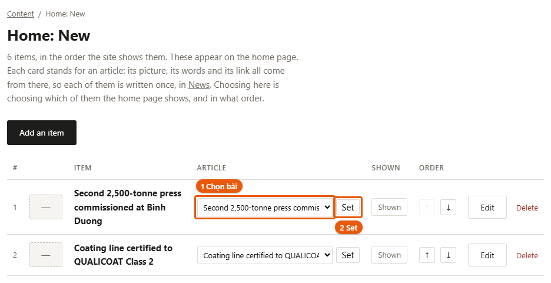
*Hình 12 — Kệ Home: New trên trang chủ. (1) chọn bài muốn trưng ở ô ARTICLE, (2) bấm Set.*

### Thêm nhà máy hoặc kho — **Factories**

Bản đồ nhà máy trên trang chủ vẽ mỗi điểm từ ô **location on the map**. Chọn tỉnh ở đó thì ghim
dời tới tỉnh đó; ô **province as written** chỉ là dòng chữ in dưới tên, **không dời ghim**.

1. **Content** → **Factories** → **Add an item**. Điểm mới lên dòng 1, **chưa có trên bản đồ**
   cho tới khi bạn chọn tỉnh.
2. Bấm **Edit** ở dòng 1. Cột trái mở nhóm **Factories**, các ô của điểm mới ở trên cùng.
3. **Factory #1 location on the map**: chọn tỉnh/thành. Ghim đặt ở tỉnh lỵ.
4. **Factory #1 type**: **Factory** (ghim tròn) hoặc **Warehouse** (ghim vuông; bản đồ tự thêm dòng
   chú giải *Warehouse*).
5. Điền tên, **province as written**, mô tả, công suất (**capacity**), năm hoạt động.
6. Bấm **Save changes**.

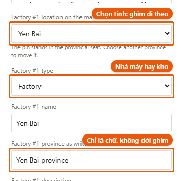
*Hình 13 — Các ô của một nhà máy. Ô location on the map dời ghim; ô type chọn nhà máy hay kho; ô province as written chỉ là chữ in trên trang.*

> **Con số lớn cạnh tiêu đề tự đếm số nhà máy** (không đếm kho). Nhưng dòng tiêu đề như *Five
> factories,* là chữ bạn gõ — thêm hay bớt nhà máy thì sửa lại chữ đó cho khớp.
>
> Danh sách là **63 tỉnh cũ** (trước sáp nhập 2025): ghim chỉ cần đúng vùng. Muốn ghi tên tỉnh
> mới thì gõ vào ô **province as written**.

---

## 6. Đăng một bài tin mới

1. **Content** → **News** → **Add an item**. Máy báo *Added. It is at the top of the list.*
2. Ngay lập tức bấm **Shown** ở dòng 1 để thành **Hidden** (bài trống đã hiện trên trang).
3. Bấm **Edit** ở dòng 1. Cột trái hiện nhóm **News** với các ô của bài.
4. Điền **Article #1 title** (tiêu đề), **Article #1 summary** (tóm tắt), **Article #1 author**
   (tác giả), và ảnh bằng **Choose picture**.
5. **Ngày đăng** — ô **Article #1 date**: bấm biểu tượng lịch ở cuối ô rồi chọn ngày. Trên trang,
   ngày hiện thành chữ, ví dụ *28 September 2026*.
6. **Thân bài** — bấm **Add a paragraph**. Máy hỏi *Save your … changes first?* — bấm **OK**: máy
   lưu những gì bạn vừa gõ, thêm một ô đoạn văn trống, và đặt sẵn con trỏ trong ô đó. Gõ đoạn văn.
   Cần đoạn nữa thì bấm **Add a paragraph** lần nữa.
7. **Thẻ** (chữ ngắn hiện trên bài, ví dụ *Plant*, *Product*) — bấm **Add a tag**, làm y như đoạn văn.
8. Bấm **Save changes**. Địa chỉ bài lúc này thành tiêu đề (xem lưu ý ở mục 5).
9. Quay về **Content** → **News**, bấm **Hidden** để thành **Shown**.

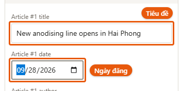
*Hình 14 — Bài mới vừa thêm: ô tiêu đề và ô ngày đăng. Bấm biểu tượng lịch ở cuối ô ngày để chọn ngày.*

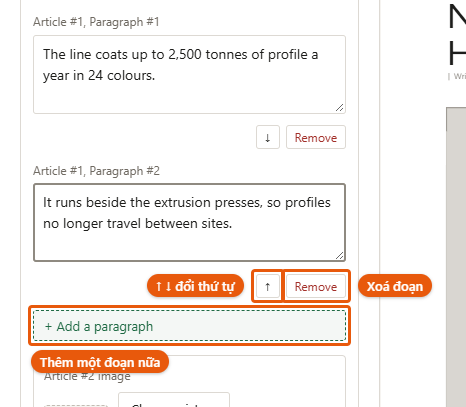
*Hình 15 — Các đoạn thân bài. Dưới mỗi đoạn có ↑ ↓ để đổi thứ tự và Remove để xoá đoạn; nút Add a paragraph thêm một đoạn mới ở cuối.*

**Dưới mỗi đoạn văn và mỗi thẻ** có ba nút nhỏ:

| Nút | Làm gì |
|---|---|
| **↑** **↓** | Đưa đoạn đó lên hoặc xuống một bậc. Đoạn đầu không có ↑, đoạn cuối không có ↓. |
| **Remove** | Xoá đoạn đó. Đoạn đang có chữ thì máy hỏi lại, kèm mấy chữ đầu của đoạn. |

> **Thêm, xoá, đổi thứ tự đoạn được lưu ngay**, không chờ **Save changes** — nên máy mới hỏi lưu
> phần đang gõ dở trước. Mỗi lần như vậy đều có một bản cũ trong **History**, lỡ tay thì lấy lại
> được (mục 9).

**Ngày đăng quyết định chỗ đứng của bài**: danh sách tin xếp theo ngày, mới nhất ở trên. Bài
**chưa có ngày** nằm cuối danh sách — cột trái nhắc *Not dated yet* dưới ô ngày cho tới khi bạn chọn.

**Bài đã có sẵn** sửa y như vậy: **Content** → **News** → **Edit** ở dòng bài đó. Ngày, đoạn văn
và thẻ của bài cũ đều sửa, thêm, xoá được.

---

## 7. Phần hiện trên Google — nhóm **Search result**

Ở cuối cột trái, ngay trước **Site — header and footer**:

| Ô | Là gì |
|---|---|
| **Search title** | Tiêu đề trên kết quả tìm kiếm và trên tab trình duyệt |
| **Search description** | Dòng mô tả dưới tiêu đề trong kết quả tìm kiếm |
| **Share picture** | Ảnh hiện khi ai đó chia sẻ trang lên Facebook, Zalo… (chỉ có ở các trang danh sách; trang của một bài thì dùng luôn ảnh của bài) |

**Để trống cũng được.** Chữ xám mờ trong ô là thứ trang đang tự dùng — với một bài tin thì đó là
tiêu đề và phần tóm tắt của bài. Chỉ gõ vào khi muốn nói khác đi.

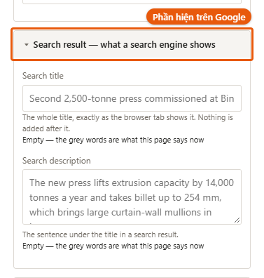
*Hình 16 — Nhóm Search result ở cuối cột trái, gồm Search title, Search description và Share picture. Chữ xám mờ trong ô là thứ trang đang tự dùng.*

Dưới ô có đếm ký tự. *Khoảng 60* và *khoảng 160* là chỗ Google thường cắt bớt, không phải giới
hạn của trang: gõ dài hơn vẫn lưu đủ.

---

## 8. Đơn khách gửi — **Enquiries**

Đơn mới nhất ở trên cùng. Chưa có đơn nào thì màn hình ghi *Nothing yet.*

**Đơn KHÔNG tự gửi về email** — phải vào màn hình này xem. Muốn có email báo thì cần làm thêm.

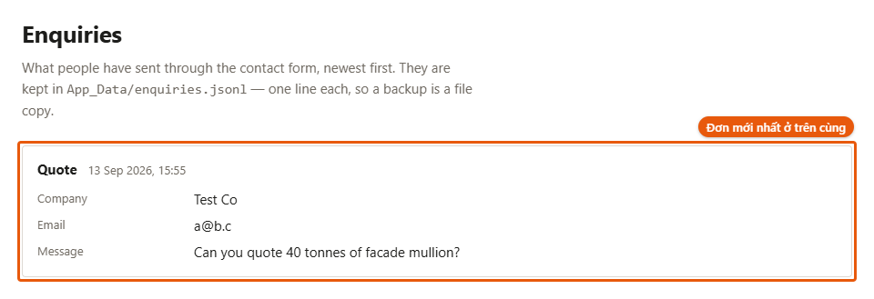
*Hình 17 — Màn hình Enquiries: mỗi đơn là một khung, đơn mới nhất ở trên cùng.*

### Tự thử xem form còn chạy không

1. Mở **https://aluminumboss.com/contact/** ở một tab khác hoặc trên điện thoại
2. Trang có bốn ô. Bấm **START** trong ô **Request a quotation** (ba ô kia cũng dẫn tới form:
   **REQUEST SAMPLES**, **ASK AN ENGINEER**, **APPLY**)

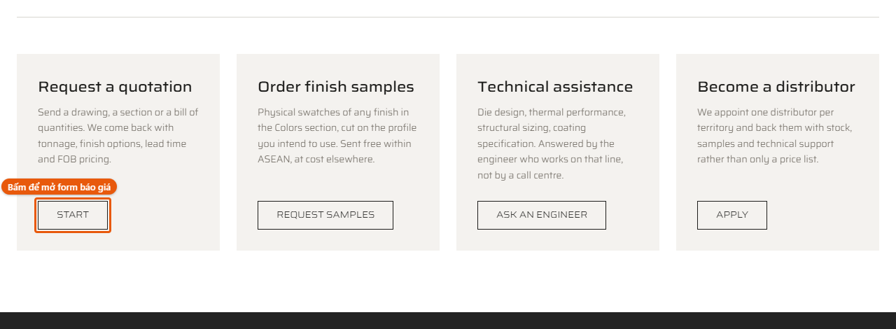
*Hình 18 — Trang liên hệ có bốn ô. Bấm START ở ô Request a quotation để mở form báo giá.*
3. Điền các ô có dấu `*`, và ghi rõ chữ *thử* trong nội dung để sau khỏi nhầm
4. Bấm nút gửi ở cuối form (form báo giá ghi **Start**). Trang báo *Thank you — we have your
   request and will reply within one working day.*
5. Quay lại **Enquiries**, tải lại trang: đơn vừa gửi phải nằm trên cùng

> Mỗi địa chỉ mạng chỉ gửi được **8 đơn một giờ** — đó là chặn thư rác. Thử nhiều lần liên tiếp sẽ
> bị chặn: đợi sang giờ sau, hoặc thử từ mạng khác (tắt Wi-Fi, dùng 4G).

---

## 9. Lỡ tay thì lấy lại — **History**

Mỗi lần Save, bản cũ được giữ lại. Màn hình **History** liệt kê: lúc lưu (**SAVED**), loại nội dung
(**CONTENT**), ai lưu (**BY**), dung lượng (**SIZE**).

- Các nút tròn phía trên (**Everything**, **news**, **site**…) lọc theo loại nội dung
- **Look at it** mở bản đó ra xem (dạng kỹ thuật — chủ yếu để xem đúng lúc nào)
- **Restore this version** đưa về bản đó

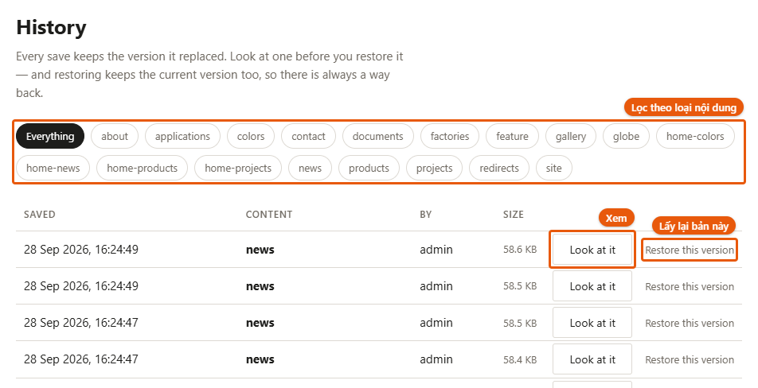
*Hình 19 — Màn hình History. Các nút tròn ở trên lọc theo loại nội dung; mỗi dòng có Look at it (xem) và Restore this version (lấy lại bản đó).*

> **Restore đưa CẢ loại nội dung đó về bản cũ, không phải một ô.** Khôi phục **news** về hôm qua
> để sửa một lỗi chính tả thì **mọi bài tin** sửa từ hôm qua tới nay cũng quay về. Sửa nhầm một
> chữ thì gõ lại chữ đó là an toàn hơn.
>
> Trước khi khôi phục, máy lưu bản hiện tại thành một dòng *(before restore)* — nên khôi phục
> nhầm thì khôi phục lại dòng đó là xong.

Mỗi loại giữ **50 bản gần nhất**. **Ảnh** và **đơn liên hệ** không nằm trong History.

Tên loại nội dung trong History là tên tệp. Tra nhanh:

| Tên | Chứa gì |
|---|---|
| news | Tất cả bài tin |
| products | Các dòng sản phẩm |
| colors | Các màu hoàn thiện |
| projects | Các dự án |
| documents | Tài liệu tải về |
| about | Trang giới thiệu (About us) |
| contact | Trang liên hệ và các form |
| site | Menu, chân trang, tên thương hiệu, tiêu đề tìm kiếm của các trang danh sách |
| home-news, home-products, home-colors, home-projects | Bốn kệ trên trang chủ |
| gallery, applications, feature | Các khối ảnh và tab trên trang chủ |
| globe, factories | Tuyến xuất khẩu và nhà máy trên trang chủ |
| redirects | Chuyển hướng địa chỉ cũ — máy tự ghi, không cần đụng tới |

---

## 10. Khi có trục trặc

| Hiện tượng | Làm gì |
|---|---|
| Bấm Save changes, báo *Could not reach the server. Nothing was saved.* | Chưa lưu gì, chữ vẫn còn trong ô. Kiểm tra mạng rồi bấm Save lại. Vẫn vậy thì chép chữ vừa sửa ra chỗ khác, tải lại trang (đăng nhập lại nếu được hỏi), dán vào và Save. |
| Báo *… could not be written* | Một phần không lưu được. Tải lại trang để xem phần nào đã lưu, rồi sửa lại phần còn thiếu. |
| Sửa xong mà trang ngoài chưa đổi | Tải lại trang bằng **F5**. |
| Trình duyệt báo "không bảo mật" | Kiểm tra địa chỉ có phải **https://**aluminumboss.com. Gõ `http://` thì trang tự chuyển sang `https://`. |
| Quên mật khẩu | Nhờ người kỹ thuật làm theo mục 11. |
| Cả trang không vào được | Nhờ người kỹ thuật — `tools/deploy/README.md`, mục *Khi hong*. |

---

## 11. Phần dành cho người kỹ thuật

Chi tiết đầy đủ ở `tools/deploy/README.md`. Tóm tắt:

**Máy chủ** `202.92.6.174`, SSH cổng `24700`, đăng nhập bằng khoá `~/.ssh/qlweb2_vps`. Ứng dụng
.NET 8 sau nginx, chứng chỉ Let's Encrypt tự gia hạn, CSDL **MySQL** (chỉ nghe `127.0.0.1`).

**Đưa bản mã nguồn mới lên:**

```bash
bash tools/deploy/push.sh
```

Lệnh này **không** đụng vào nội dung khách đã sửa trên máy chủ — dữ liệu trên máy chủ mới là bản
thật. Chỉ thêm `--kem-noi-dung` khi thật sự muốn đẩy nội dung từ máy làm việc lên, và lúc đó nó
ghi đè thật.

**Quên mật khẩu admin** — xoá dòng tài khoản rồi khởi động lại; máy chủ tự tạo lại `admin` /
`changeme` và bắt đổi mật khẩu như lần đầu. Lịch sử sửa còn nguyên:

```bash
ssh -p 24700 -i ~/.ssh/qlweb2_vps root@202.92.6.174 "mysql qlweb2 -e 'DELETE FROM AdminUsers' && systemctl restart qlweb2"
```

**Sao lưu** tự chạy lúc **00:00** mỗi đêm (cron), giữ **3 bản gần nhất**, trong
`/srv/qlweb2/sao-luu/`: `qlweb2-*.sql.gz` (CSDL: tài khoản + lịch sử), `noi-dung-*.tar.gz` (chữ
của trang, ảnh, đơn liên hệ) và `ma-nguon-*.tar.gz` (bản ứng dụng đang chạy + cấu hình máy chủ).
Cách khôi phục: `tools/deploy/README.md`, mục *Sao luu*.
